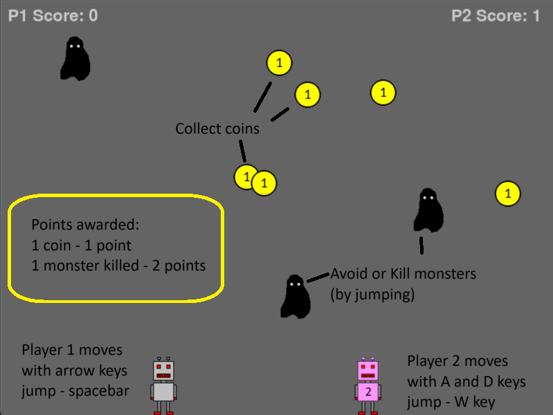
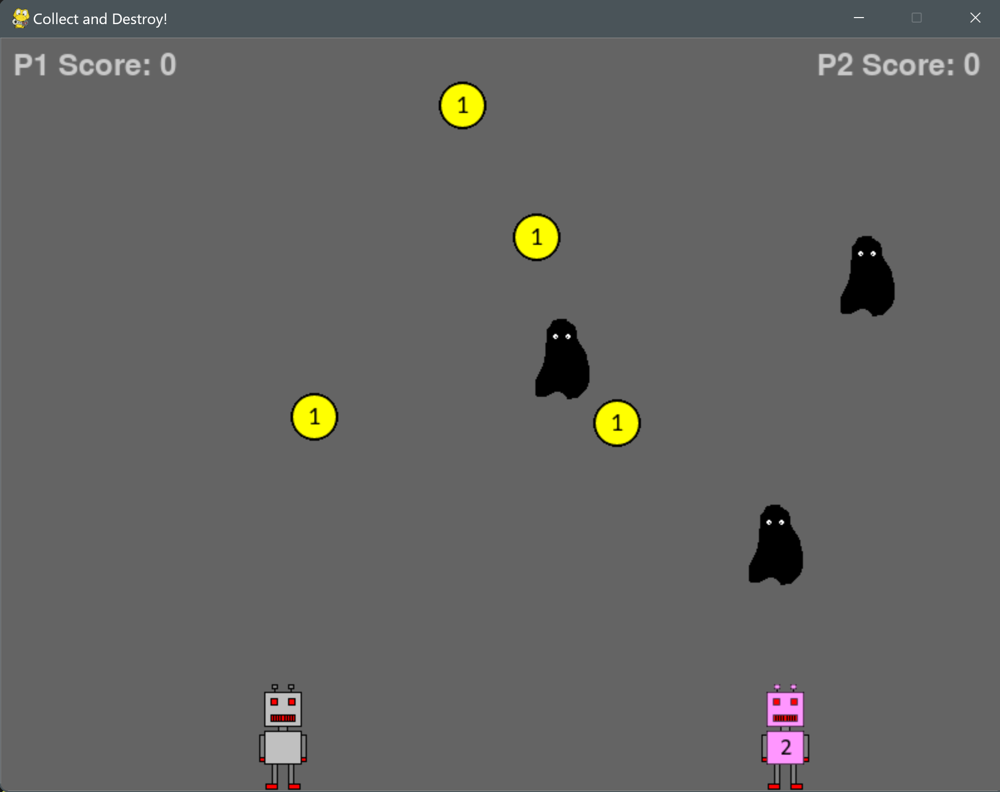

# Coin_Collecting_Game
One or two player simple game

A fun 2D arcade-style game built with Python and Pygame where players collect coins, avoid monsters, and compete for the highest score!

## 🎮 How to Play

- **Choose your game mode**: Play solo or with a friend (1 or 2 players).  
- **Move your character**:  
  - **Player 1**: `Left` and `Right` arrow keys to move, `Space` to jump.  
  - **Player 2**: `A` and `D` keys to move, `W` to jump.  
- **Collect coins**: Grab falling coins to increase your score.  
- **Avoid monsters**: If a monster touches you, you lose!  
- **Destroy monsters**: Jump on them to eliminate them and earn bonus points.

## 🖥️ Installation

1. Install Python (3.x recommended)  
2. Install Pygame using:  
   ```bash
   pip install pygame

## 🎮 Run the Game
Navigate to the game directory and execute:

```bash
python main.py
```

## 🔄 Game Flow
1. **Mode Selection**: Choose between 1-player or 2-player mode.
2. **Rules Screen**: A screen displaying game instructions ().
3. **Game Start**: Players move to collect coins and avoid or destroy monsters.
4. **Game Over**: If both players die, the game ends and displays the scores.
5. **Restart or Exit**:
   - Press **R** → Restart the game.
   - Press **ESC** → Exit the game.

## 📷 Screenshots



## 🛠️ Features
✅ Single & Multiplayer Modes  
✅ Game Mode Selection Screen  
✅ Smooth Coin Collection Mechanism  
✅ Jumping Mechanism to Destroy Monsters  
✅ Game Over and Restart Functionality  
✅ Customizable Graphics & Controls  

## 🚀 Future Enhancements
🔹 Add more levels and increasing difficulty.  
🔹 Introduce power-ups and obstacles.  
🔹 Implement sound effects and background music.  
🔹 Add leaderboard functionality.  

## 📝 License
This project is open-source and free to use. Feel free to modify and improve it!

🎉 **Enjoy playing Collect and Destroy!** 🎮

